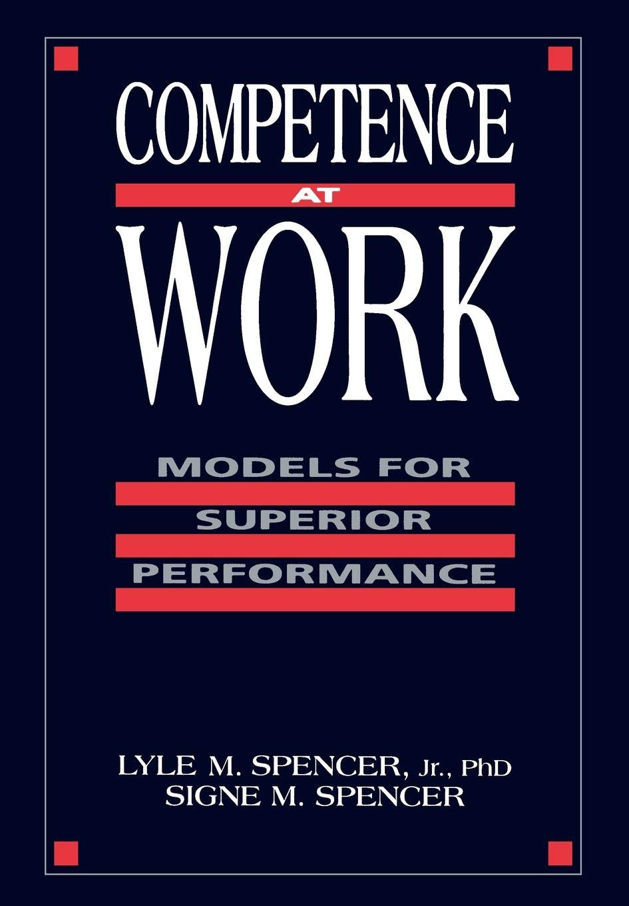



دو سال پیش و به‌خاطر نیازی که در کار داشتم، سراغ این کتابی که مدّت‌ها در قفسه خاک می‌خورد رفتم و بعد، در دو نوبت (با فاصله زمانی یک سال) دو «Aha Moment» رو تجربه کردم: اوّلی، مربوط به جا افتادن مفهوم شایستگی بود و دومی، در مورد شایستگی‌های مختلف، سطح‌بندی‌شون و شیوه رسیدن به این نتایج. بعد به نظرم رسید که احتمالاً برای دیگران هم جالب باشه و به همین دلیل، پس از تجربه اول در پاییز ۱۳۹۹، خلاصه‌ای از بخش اول کتاب رو که به پیشینه موضوع و تعریف شایستگی می‌پرداخت، [در ویرگول منتشر کردم](https://vrgl.ir/5cstr). در تجربه دوم امّا به دلیل حجم مطلب و شیوه ارائه‌ای که دوست داشتم، تصمیم گرفتم که محتوا رو در یک سایت منتشر کنم و نتیجه‌ی کار، همین صفحاتی‌ست که پیش روی شماست.

کتاب، شامل ۵ بخش (و ۲۵ فصل) است که اینجا فقط بخش‌های اوّل و دوم ترجمه شده‌اند. همچنین، برای ساده‌تر شدن استفاده، جزییاتی (بیش‌تر از بخش اوّل) حذف شده و تغییراتی جزیی در نحوه ارائه بخش دوم ایجاد کرده‌ام.

<--->

### شایستگی در کار

#### مدل‌هایی برای عملکرد عالی

 

**نویسندگان:** لایل اسپنسر و سیگنی اسپنسر

**مترجم:** [حسین طالقانی](https://a3dho3yn.ir)


